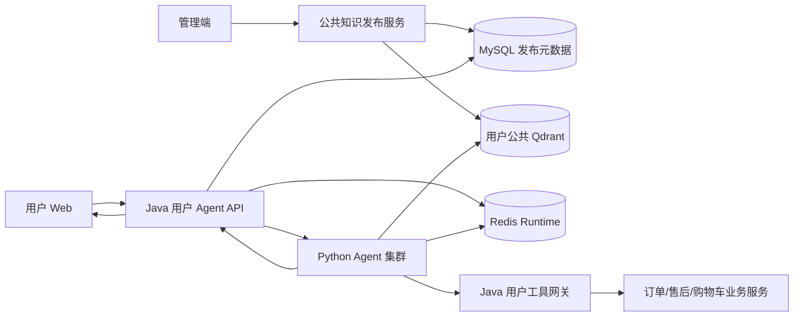
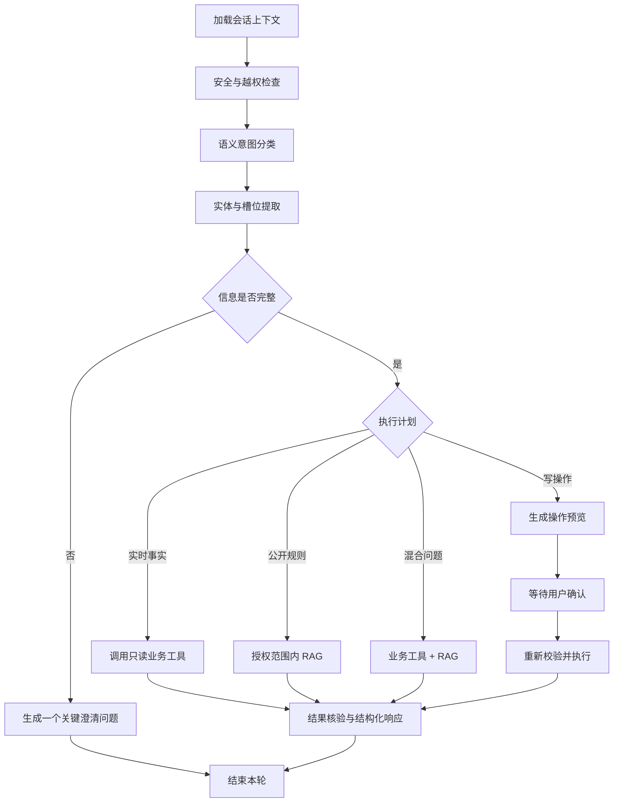

# 饱饱点餐用户端 Agent 第二阶段实施计划书

## 1. 项目目标

第二阶段将用户端 Agent 从“查询与加购助手”升级为可在生产多实例环境运行的业务助手，形成以下能力闭环：

1. 使用由管理端维护、审核和发布的用户公共知识库进行可信 RAG；
2. 支持 Agent 发起取消订单、催单和提交售后申请；
3. 对不可逆业务操作执行“预检—用户确认—执行—结果核验”；
4. 使用 Redis 持久化 LangGraph checkpoint、任务状态和事件流，支持多实例部署；
5. 建立评测、审计、监控、灰度发布和故障恢复能力。

## 2. 已确认的需求边界

### 2.1 纳入本阶段

- 用户公共知识库由管理端操作，用户端不显示知识库管理入口；
- 公共知识的上传、解析、审核、发布、下线和回滚；
- Agent 自动检索当前已发布的公共知识，用户不能指定 `kb_id`；
- 取消订单、催单、提交售后申请；
- Redis LangGraph checkpoint；
- Python Agent 任务状态、事件回放和消费租约的分布式存储；
- Java 与 Python 多实例部署；
- 高风险操作确认、幂等、资源版本校验和审计；
- RAG、工具、工作流和跨用户、跨 Profile 安全评测。

### 2.2 不纳入本阶段

- Agent 直接支付；
- Agent 自动确认收货；
- 未经用户确认自动取消订单或自动申请售后；
- 业务主体扩展，以及知识、规则、商品、库存、员工、订单和结算的主体隔离；该能力后续单独立项；
- 让用户上传文档、选择知识库或传入任意 `kb_id`；
- 仅依靠自由文本 RAG 判断严重过敏原安全。

### 2.3 单业务主体范围说明

第二阶段维持当前单业务主体模型，不新增主体标识和主数据，不改造订单、Agent 会话、知识发布或规则表的主体字段。公共知识和业务规则服务于当前业务主体。多门店能力后续单独立项，届时统一设计商品、库存、订单、知识和规则边界。

## 3. 技术选型声明

### 3.1 公共知识发布

采用“管理端发布控制面 + 用户 Agent 只读数据面”：

- MySQL 保存知识元数据、审核状态和不可变发布版本；
- Qdrant `sky_user_public_knowledge` 保存公共知识向量；
- 每个向量携带 `release_id`、`document_id`、`document_version`、`category` 和有效期元数据；
- Java 在每次任务提交时生成不可篡改的 `KnowledgeScope`；
- Python 只能在该 Scope 内检索，不能接受用户输入的知识库标识。

### 3.2 分布式工作流与任务

采用 Redis 作为生产运行时协调层：

- LangGraph 使用 Redis checkpoint saver；
- 任务状态使用 Redis Hash；
- 任务队列和事件回放使用 Redis Streams + Consumer Group；
- 幂等、执行租约和取消信号使用 Redis 原子操作；
- MySQL 继续作为用户会话、消息、业务任务、确认和审计的最终权威来源；
- SQLite 与内存 checkpoint 仅保留为本地开发模式。

### 3.3 高风险操作

取消订单和提交售后采用现有确认基础设施扩展后的三阶段协议：

```text
prepare（归属/状态/参数校验）
→ confirmation_required（展示影响范围）
→ 用户确认
→ execute（重新校验资源版本）
→ verify（读取最终业务状态）
```

催单属于可恢复、低风险操作，不要求二次确认，但必须执行状态校验、频率限制、幂等和审计。

### 3.4 三条最关键的改进建议

1. **知识授权由 Java 决定**：Python 只消费签发好的发布版本范围，浏览器与模型都不能决定检索哪个知识库。
2. **业务写入必须再次校验**：确认之前和真正执行之前分别校验用户归属、订单状态及 `resource_version`，防止确认期间订单状态变化。
3. **多实例不能继续依赖进程内状态**：checkpoint、任务、事件、取消信号和执行租约必须迁移到 Redis，任何实例都应能继续同一任务。

## 4. 总体架构



职责边界：

- 浏览器：展示、输入与明确确认，不承担知识范围和权限判断；
- Java：JWT、知识授权、业务事务、确认、幂等、审计；
- Python：语义理解、工作流、RAG、工具规划和流式输出；
- Redis：分布式运行时状态，不作为订单等业务事实来源；
- MySQL：业务事实、发布版本、消息、确认和审计的权威存储；
- Qdrant：只保存可公开知识的可检索副本。

## 5. 结构化业务规则边界

- 配送、支付、售后和催单等结构化规则继续由现有 Java 业务服务执行；
- 公共知识文档只负责解释规则，不能让 RAG 文本直接驱动金额计算或业务状态变更；
- 第二阶段不另建多租户规则系统，也不扩张现有业务数据模型；
- 如果后续确有规则发布和回滚需求，可独立设计规则版本，但不作为本阶段知识库建设的前置条件。

## 6. 用户公共知识库设计

### 6.1 控制面

管理端新增独立菜单“用户公共知识库”，与“内部知识库”分开。权限建议：

- `PUBLIC_KB_READ`：查看；
- `PUBLIC_KB_EDIT`：上传和编辑草稿；
- `PUBLIC_KB_REVIEW`：审核；
- `PUBLIC_KB_PUBLISH`：发布、下线和回滚。

发布版本保留显式审核与审计步骤，但允许同一管理员完成创建和审核，以适配单管理员部署。

### 6.2 生命周期

```text
DRAFT
→ INDEXING
→ REVIEW_PENDING
→ APPROVED
→ PUBLISHED
→ SUPERSEDED / OFFLINE
```

上传成功不代表用户可检索。只有 `PUBLISHED` 且在有效期内的版本能够绑定给用户 Agent。

### 6.3 数据模型

在现有 `user_agent_knowledge_*` 表族基础上扩展：

- `user_agent_knowledge_base`：增加内容分类和生命周期字段；
- `user_agent_knowledge_document`：保存文档版本、审核状态、内容哈希和来源；
- `user_agent_knowledge_release`：不可变发布版本；
- `user_agent_knowledge_release_document`：发布版本包含的具体文档版本；
- `user_agent_knowledge_binding`：场景与发布版本绑定；
- `user_agent_knowledge_review`：审核意见和审核人；
- `user_agent_knowledge_publish_audit`：发布、下线、回滚审计。

知识与业务事实冲突时优先级为：

```text
结构化实时业务规则
> 已发布公共知识
> 无证据拒答
```

### 6.4 运行时授权

Java 根据 `intent + current_time` 查询有效绑定并生成：

```json
{
  "release_ids": ["release-public-v3"],
  "document_versions": {"doc-a": 3, "doc-b": 7},
  "categories": ["SERVICE_POLICY", "PRODUCT_GUIDE"],
  "expires_at": "2026-09-27T12:05:00Z"
}
```

该 Scope 由 Java 内部调用传递，不进入用户 DTO。Python 检索必须同时匹配集合、发布版本、文档版本和有效期。

### 6.5 RAG 执行顺序

现有实现是在工作流之前尝试 RAG，第二阶段调整为：

```text
意图识别
→ 判断 REALTIME_TOOL / PUBLIC_RAG / HYBRID / CLARIFY
→ 在 Java 授权 Scope 内检索
→ 证据质量判断
→ 工具调用或生成引用回答
```

- 订单、价格、库存、配送费和营业状态走实时工具；
- 退款政策、配送说明和操作帮助走公共 RAG；
- “某菜是否含过敏原”采用结构化商品资料 + 审核知识的 HYBRID；
- 没有证据时明确拒答，不用模型常识补全项目事实。

## 7. 用户业务工具扩展

### 7.1 新工具

| 工具 | 风险 | 是否确认 | 关键限制 |
|---|---:|---:|---|
| `request_order_cancellation` | 高 | 是 | 仅本人、可申请状态 |
| `remind_order` | 低 | 否 | 仅待接单、冷却限频 |
| `submit_after_sale` | 高 | 是 | 本人、原因必填、时限校验 |
| `preview_order_action` | 只读 | 否 | 返回影响、退款预期和当前版本 |

不复用管理端 `order.update_status`，用户工具拥有独立 operation code、参数模型、Mapper 路由和审计类型。

### 7.2 取消订单

1. 查询本人订单及当前状态；
2. Java 生成取消预览和 `resource_version`；
3. 前端展示订单号、当前状态、取消原因及是否预计退款；
4. 用户点击确认；
5. Java 锁定订单并重新校验；
6. 调用现有 AfterSale/取消业务服务；
7. 返回取消申请、订单和退款的最新状态。

待付款、待接单虽然可快速取消，仍要求界面确认，因为操作不可逆。

### 7.3 催单

- 仅允许本人“待接单”订单；
- 默认同一订单 5 分钟内只接受一次；
- Redis 原子限流键：`sky:user-agent:reminder:{userId}:{orderId}`；
- 重复请求返回最近一次已受理结果，不重复通知商家；
- 每次尝试写入用户工具审计。

### 7.4 售后申请

- 先查询订单、最近售后和规则；
- 收集并验证原因，原因不得由模型擅自补写；
- 已完成订单按现有结构化业务规则判断申请期限；
- 确认卡展示订单、申请类型、原因、可能退款说明；
- 执行时复用现有 `AfterSaleService.apply` 幂等逻辑；
- 返回申请编号、审核状态和退款状态。

## 8. 工作流设计

第二阶段 LangGraph：



意图分类不再只依赖关键词，采用“确定性安全规则 + LLM 结构化分类 + 服务端参数校验”。分类输出固定 JSON Schema，低置信度时进入澄清，不直接写业务。

关键工作流状态包括：

- `session_id`、`task_id`、`user_id`；
- `intent`、`confidence`、`slots`、`missing_slots`；
- `knowledge_scope`、`retrieval_plan`、`citations`；
- `tool_plan`、`pending_confirmation`、`resource_version`；
- `result_blocks`、`error`、`checkpoint_version`。

## 9. Redis 与多实例设计

### 9.1 Key 与 Stream 命名

```text
sky:user-agent:checkpoint:{sessionId}
sky:user-agent:task:{taskId}
sky:user-agent:task-stream
sky:user-agent:event:{taskId}
sky:user-agent:lease:{taskId}
sky:user-agent:cancel:{taskId}
sky:user-agent:idempotency:{taskId}
```

管理端继续使用独立的 `sky:admin-agent:*` 命名空间。

### 9.2 任务执行

- API 实例将任务写入 Redis Stream；
- Worker 使用 Consumer Group 竞争消费；
- 每个任务只有持有租约的 Worker 可以执行；
- Worker 定期续租，宕机后其他 Worker 可认领 pending task；
- 事件写入 Redis Stream，任意 API 实例都能提供 SSE 回放；
- Java 消费并持久化事件后，以 MySQL 事件序号作为最终回放依据；
- 取消信号跨实例发布，Worker 在模型轮次与工具调用之间检查。

### 9.3 一致性原则

- Redis 丢失时不得重复执行已经完成的高风险操作；Java 幂等键和业务表唯一约束提供最终保护；
- checkpoint 仅保存工作流进度，不保存权威订单状态；
- 恢复工作流时重新读取订单、确认和发布版本；
- SSE 事件以 `task_id + seq_no` 去重；
- 确认完成后执行工具必须使用稳定 execution id。

### 9.4 部署方式

- Java 与 Python 均无本地会话依赖；
- 生产至少运行 2 个 Java 实例和 2 个 Agent API/Worker 实例；
- 健康检查区分 liveness 与 readiness；
- readiness 检查 MySQL、Redis、Qdrant、Embedding 和必要配置，不调用付费 LLM；
- 滚动发布期间旧实例停止领取新任务，完成或释放已有租约后退出；
- 本地 Compose 可保持单实例，新增多实例集成测试配置；生产使用 Kubernetes/Helm 或等价编排。

## 10. API 与事件协议

### 10.1 用户 API

保留现有 `/user/agent/**`，新增或扩展：

- 任务提交不接受 `kb_id`；
- 确认接口校验当前用户、任务和确认凭证；
- 提供知识引用公开信息，不返回内部路径、审核人或内部 ID。

### 10.2 SSE 事件

继续保留现有事件并增加：

- `knowledge_retrieval_started`；
- `knowledge_citations`；
- `clarification_required`；
- `operation_preview`；
- `confirmation_required`；
- `operation_executing`；
- `business_state_changed`；
- `task_completed` / `task_failed`。

事件必须可持久化、可重放且具备版本字段。前端未知事件应安全忽略。

## 11. 前端交互

- 用户无知识库入口，也不显示 `kb_id`；
- 回答底部展示可公开的文档标题、版本、发布日期和引用片段；
- 澄清信息优先使用选项卡，而不是要求用户重复输入完整内容；
- 取消和售后使用专用确认卡，不能只用通用 JSON 弹窗；
- 确认卡展示操作对象、原因、当前状态、退款预期和有效期；
- 催单展示冷却时间与最近受理结果；
- 断线重连后恢复文本、卡片、待确认状态和执行结果；

## 12. 安全与合规

- 用户 JWT 身份和订单归属全部由 Java 校验；
- Prompt 中的 user id、order id 都不能作为授权依据；
- 公共知识经过文件类型、大小、恶意内容和提示词注入扫描；
- RAG 内容始终标记为不可信资料，不执行其中指令；
- 发布和回滚写入不可修改审计；
- 确认凭证短时有效、单次使用、绑定参数哈希和资源版本；
- 前端不显示完整地址、手机号和内部异常；
- 跨用户、跨 Agent Profile 请求统一返回模糊的无权或不存在结果。

## 13. 可观测性与运营指标

### 13.1 RAG

- 检索调用量、命中率、无答案率；
- 知识分类和发布版本来源分布；
- 引用覆盖率和引用正确率；
- 过期版本命中数必须为 0；
- 检索、Embedding 和 Qdrant 延迟。

### 13.2 工作流与工具

- 意图准确率、澄清率、槽位补全率；
- 工具选择准确率和失败率；
- 确认展示、接受、拒绝、过期比例；
- 取消、催单和售后的业务成功率；
- 幂等重放和资源版本冲突次数。

### 13.3 运行时

- Redis Stream backlog、pending 数和任务认领次数；
- checkpoint 保存/恢复失败；
- 首事件、首文本、任务总耗时；
- SSE 重连和回放数量；
- 实例租约丢失与重复执行拦截次数。

## 14. 测试策略

### 14.1 知识库

- 未发布、已下线、过期版本不可检索；
- 仅当前有效的发布版本可检索；
- 发布版本切换后，旧会话和任务按既定版本一致性规则执行；
- 用户无法通过 Prompt 或请求体指定内部知识库；
- 引用只暴露公开字段；
- 提示词注入文档不会改变工具或权限规则。

### 14.2 写操作

- 跨用户订单全部拒绝；
- 状态变化后旧确认失效；
- 重复确认、网络重试和 Worker 重试只执行一次；
- 催单限频正确；
- 售后原因、时限和活跃申请校验正确；
- 退款失败不导致重复申请。

### 14.3 多实例

- 实例 A 提交、实例 B SSE 回放；
- Worker 宕机后任务被安全认领；
- 滚动发布期间 checkpoint 可恢复；
- Redis 短暂不可用时高风险写操作不重复；
- 同名 session/task 在用户端和管理端 Profile 之间不串域。

### 14.4 评测集

新增至少以下场景：

- 公共规则问答及正确引用；
- 商品实时事实与知识解释混合问题；
- 多轮补齐订单号和售后原因；
- 取消确认接受、拒绝、过期和状态冲突；
- 催单限流；
- 跨用户、管理知识越权；
- 中文、英文和文档内提示词注入。

## 15. 分模块执行计划

### 模块一：公共知识发布数据基础

产出：发布版本、文档版本绑定、审核与审计表结构，以及迁移测试。

验收：现有用户知识表安全升级；未发布内容不可检索；管理内部知识保持隔离。

### 模块二：公共知识管理控制面

产出：管理端权限、知识编辑、审核、发布、下线、回滚、审计和管理页面。

验收：未发布内容无法进入用户检索；发布版本不可变；单管理员可完成审核发布且审核记录完整。

### 模块三：用户 RAG 数据面

产出：Java `KnowledgeScope`、Qdrant metadata filter、自动检索、引用和无证据拒答。

验收：用户不传 `kb_id` 也能使用已发布公共知识；绝不访问管理集合或未发布内容。

### 模块四：用户写工具

产出：取消订单、催单、售后申请工具，以及专用确认、幂等、审计和结果卡片。

验收：高风险操作必须确认；重试只执行一次；业务状态变化会使旧确认失效。

### 模块五：工作流升级

产出：语义分类、槽位补全、RAG/工具混合规划、澄清、操作预览和结果核验。

验收：多步骤场景和低置信度场景行为稳定，不因模型自由输出绕过校验。

### 模块六：Redis 与多实例生产化

产出：Redis checkpoint、Streams 任务与事件、租约、恢复、取消信号、滚动退出和部署配置。

验收：无粘性会话要求；跨实例订阅和恢复通过；Worker 故障不会重复业务写入。

### 模块七：前端、评测与灰度发布

产出：引用、澄清、取消/售后确认卡、恢复体验、监控面板、评测集和上线手册。

验收：端到端测试、跨域安全测试、多实例故障测试和确定性评测全部通过。

## 16. 推荐实施顺序与依赖

```text
模块一 公共知识发布数据基础
  ↓
模块二 公共知识控制面
  ↓
模块三 用户 RAG 数据面
  ↓
模块四 用户写工具
  ↓
模块五 工作流升级
  ↓
模块六 Redis / 多实例
  ↓
模块七 前端 / 评测 / 灰度
```

模块四可以在模块二后与模块三部分并行开发，但正式集成必须在发布版本和授权 Scope 稳定之后进行。

## 17. 上线与回退

1. 先上线公共知识发布相关数据库迁移，应用保持兼容；
2. 上线公共知识控制面，仅允许管理端试用；
3. 建立用户公共集合并发布首个审核版本；
4. 灰度开放只读 RAG；
5. 灰度开放催单；
6. 小流量开放取消和售后确认工具；
7. 切换 Redis 分布式运行时并扩容到多实例；
8. 达到指标门槛后全量开放。

每项能力配置独立 Feature Flag：

- `USER_AGENT_PUBLIC_RAG_ENABLED`；
- `USER_AGENT_REMINDER_ENABLED`；
- `USER_AGENT_CANCELLATION_ENABLED`；
- `USER_AGENT_AFTER_SALE_ENABLED`；
- `USER_AGENT_REDIS_RUNTIME_ENABLED`。

关闭 Flag 只停止新任务使用对应能力，不删除知识版本、checkpoint、确认或审计数据。

## 18. 完成定义

第二阶段只有在以下条件全部满足时才完成：

- 用户公共知识由管理端审核发布，用户无知识库管理和选择入口；
- 用户 RAG 只检索当前有效的已发布公共版本；
- 取消、催单和售后申请均走独立用户工具及 Java 权限校验；
- 取消和售后必须显式确认并具备幂等、资源版本和审计；
- LangGraph、任务和事件支持 Redis 持久化与跨实例恢复；
- 跨用户、跨 Profile、知识污染和重复执行测试全部通过；
- 前端完整支持引用、澄清、确认、结果卡和断线恢复；
- 上线、灰度、监控和回退文档齐全。
