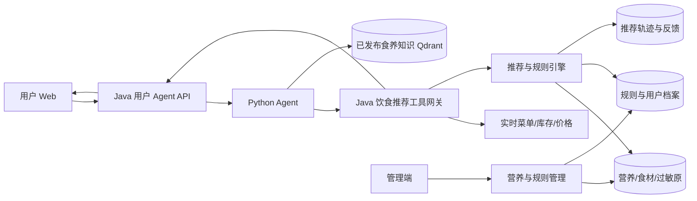

# 饱饱助手个性化健康饮食推荐实施计划书

> 文档版本：1.0  
> 制定日期：2026-10-01  
> 项目定位：在真实可售菜单范围内，为用户提供安全、可解释、可执行的个性化饮食推荐

## 1. 项目背景与目标

当前饱饱助手已经具备用户会话、实时菜品查询、推荐卡片、购物车操作、订单查询、公共知识 RAG、工具确认和流式响应等基础能力，但推荐仍主要依赖用户文本关键词和模型理解，缺少支撑健康饮食决策所必需的结构化数据、规则和安全边界。

本阶段将饱饱助手从“会查询和加购的点餐助手”升级为“基于真实菜单的个性化饮食决策助手”，形成以下闭环：

1. 理解用户的用餐目标、忌口、过敏、地域、时令和已明确的健康限制；
2. 从实时在售、库存可用的菜品中生成候选集；
3. 使用结构化食材、营养和过敏原数据执行安全过滤；
4. 使用版本化、可审计的食养规则完成健康目标匹配和排序；
5. 给出推荐理由、关键营养信息、风险提示和依据来源；
6. 支持用户直接加入购物车、替换菜品并反馈推荐效果；
7. 对无法安全判断、存在冲突或属于医疗诊断范围的请求主动降级、追问或建议就医。

目标决策链：

```text
用户自然语言需求
→ 意图与风险分级
→ 获取用户长期档案与本次临时条件
→ 必要信息追问
→ 查询实时可售菜品
→ 过敏原与硬约束过滤
→ 营养、目标、地域、时令、口味和预算评分
→ 安全校验
→ 生成可解释推荐
→ 加购/替换/反馈
```

## 2. 现状评估与核心缺口

### 2.1 已有基础

- Java 21、Spring Boot、MyBatis、MySQL、Redis；
- Python Agent、流式任务、工具调用和双 Agent 数据隔离；
- Qdrant、Embedding 服务和公共知识发布链路；
- 实时菜单、购物车、结算、订单、售后和通知能力；
- Vue 用户端和管理端；
- Docker Compose、健康检查、Prometheus 和 Grafana；
- Java、Python、用户端、管理端单元与集成测试基础；
- 已有用户端推荐卡片及从推荐结果加入购物车的交互。

### 2.2 当前缺口

1. `Dish` 和 `Setmeal` 缺少标准份量、食材、营养、过敏原、烹饪方式和时令等数据；
2. `User` 缺少饮食目标、忌口、过敏、地区和健康限制档案；
3. Agent 只识别“低脂、清淡、忌口”等文本，未形成结构化约束；
4. 当前推荐无法证明某道菜为什么适合，也无法可靠证明某道菜应被排除；
5. 公共知识库保存的是解释性内容，不能直接承担营养计算和安全裁决；
6. 缺少推荐执行轨迹、规则命中记录、用户反馈和离线评测集；
7. 缺少疾病饮食请求的风险分级、拒答与升级机制；
8. 管理端缺少营养数据维护、数据审核、规则发布和数据完整度检查页面。

## 3. 已确认需求与实施假设

### 3.1 首版目标用户

- 以具备自主点餐能力的成人用户为首版对象；
- 首版不针对婴幼儿、孕产妇、重症患者或需要临床营养治疗的人群生成个体化医疗方案；
- 用户可以只提供本次需求，也可以自愿保存长期饮食档案；
- 推荐结果必须来自当前真实在售商品，不生成菜单中不存在的菜品。

### 3.2 首版重点场景

1. 食物过敏、明确忌口和不喜欢食材的安全过滤；
2. 减脂、控制能量、清淡、高蛋白等日常健康目标；
3. 根据用户所在地区、日期、季节和当季食材推荐；
4. 不知道吃什么时，结合人数、预算、口味和历史反馈推荐；
5. 针对有权威食养指南支持的常见慢病，进行保守的菜品筛选和风险提示；
6. 身体不适时提供一般性饮食选择和就医边界提示，不诊断、不承诺治疗效果。

### 3.3 首版慢病范围

首版优先选择规则较明确且有权威公开指南支持的场景：

- 成人高血压；
- 成人糖尿病；
- 成人高脂血症；
- 成人超重/肥胖；
- 高尿酸血症/痛风作为扩展候选，在基础营养和食材数据稳定后接入。

慢性肾病、复杂肝病、肿瘤营养、妊娠期疾病、进食障碍和多病共存不进入首版自动个性化推荐，只允许展示一般教育信息并提示咨询医生或营养师。

## 4. 明确不纳入本阶段

- 诊断疾病、解释化验单或判断病情严重程度；
- 替代医生、临床营养师或药师制定治疗方案；
- 宣称某道菜可以治疗、治愈或预防具体疾病；
- 根据未经审核的网络文章自动生成疾病饮食规则；
- 用户只说“生病了”时直接给出确定性饮食处方；
- 依赖大模型常识判断过敏原、营养值或药物相互作用；
- 自动计算胰岛素剂量、药物剂量或修改医生给出的饮食限制；
- 在食材或交叉接触风险未知时将菜品标记为“绝对安全”；
- 首版覆盖所有年龄、疾病、地区和节气养生体系；
- 未经用户明确同意长期保存健康相关信息。

## 5. 安全与产品边界

### 5.1 请求风险分级

| 等级 | 示例 | 系统行为 |
|---|---|---|
| L0 普通偏好 | 不辣、两个人、预算 100 元 | 直接推荐并允许加购 |
| L1 健康目标 | 减脂、清淡、高蛋白 | 基于结构化营养排序，说明不是医疗方案 |
| L2 明确限制 | 花生过敏、医生要求低钠 | 作为硬约束过滤，未知信息不得判定安全 |
| L3 常见慢病 | 已确诊高血压，想选晚餐 | 引用已发布规则，必要时追问，保守推荐 |
| L4 高风险医疗 | 急性严重症状、复杂肾病、多病共存、药物冲突 | 不生成个体化方案，提示及时就医或咨询专业人员 |

### 5.2 三类约束

- **禁止约束**：已知过敏原、明确医生禁忌、不可接受食材；命中后必须排除；
- **限制约束**：钠、糖、脂肪、能量等阈值；超过阈值时排除或显著降权；
- **偏好约束**：口味、地域、时令、价格、历史喜好；仅参与排序，不能覆盖安全约束。

约束优先级：

```text
生命安全与明确过敏
> 医生给出的明确限制
> 已发布结构化食养规则
> 用户健康目标
> 实时库存与营业约束
> 口味、地域、时令、价格和历史偏好
```

### 5.3 信息不足策略

- 对关键安全信息最多进行 1～3 个必要追问；
- 用户拒绝提供信息时，退回到不涉及疾病个性化的普通推荐；
- 成分未知、营养数据未审核、规则冲突时显示“不确定”，不得伪装成安全结论；
- 没有合适菜品时明确告知，而不是放宽过敏或医疗约束；
- 推荐卡片必须区分“适合”“需注意”“不推荐”和“信息不足”。

## 6. 技术选型声明

### 6.1 结构化决策优先于纯 RAG

采用“结构化规则引擎 + 实时业务数据 + 已发布权威知识 + Agent 编排”的混合方案：

- Java 负责营养计算、硬约束过滤、规则执行、排序结果和审计；
- Python Agent 负责意图理解、槽位抽取、必要追问、工具编排和自然语言解释；
- MySQL 保存营养、食材、过敏原、规则、用户档案、推荐轨迹和反馈；
- Qdrant 只保存已发布的解释性食养知识，用于引用和说明；
- 实时菜品、库存、价格和营业状态继续由 Java 业务服务提供；
- LLM 不直接输出最终安全裁决，也不能绕过 Java 推荐结果推荐其他菜品。

### 6.2 首版规则引擎

首版不引入 Drools 等重型规则平台，使用 Java 类型化规则模型与可配置规则表：

- 规则条件采用受控操作符：`EQ`、`IN`、`CONTAINS`、`LT`、`LTE`、`GT`、`GTE`、`UNKNOWN`；
- 规则动作采用受控枚举：`EXCLUDE`、`WARN`、`BOOST`、`PENALIZE`、`REQUIRE_CLARIFICATION`；
- 规则按版本发布，不执行管理端输入的脚本、SpEL 或任意代码；
- 规则发布前进行模式校验、冲突检测和回归评测；
- 后续规则数量和复杂度达到阈值后再评估独立规则引擎。

### 6.3 推荐排序

首版采用可解释的加权排序，不直接采用黑盒机器学习：

```text
final_score =
  nutrition_goal_score
  + season_region_score
  + taste_score
  + budget_score
  + history_feedback_score
  - soft_constraint_penalty
```

硬约束在评分前完成过滤。每个分数和扣分都必须写入推荐轨迹，便于页面解释、测试和问题追踪。数据量和反馈量达到要求后，再评估 Learning to Rank。

### 6.4 三条最关键的改进建议

1. **先补真实数据，再优化提示词**：没有食材、营养、过敏原和标准份量数据，任何健康推荐都无法可靠验证。
2. **Java 做安全裁决，LLM 做理解与解释**：模型可以提取需求和生成自然语言，但不能决定过敏原安全、营养阈值和疾病禁忌。
3. **先做少量场景的高质量闭环**：首版把过敏、减脂、时令地域和一组常见慢病做深，并用评测证明安全性，不宣称覆盖所有疾病。

## 7. 总体架构



职责边界：

- 用户端：采集用户主动提供的信息，展示推荐、依据、注意事项和反馈入口；
- 管理端：维护并审核菜品营养、食材、过敏原、时令数据和规则版本；
- Java：权限、隐私同意、候选查询、规则、计算、排序、审计和最终业务动作；
- Python：意图识别、风险分级、槽位填充、追问、工具编排和解释；
- MySQL：结构化事实和版本状态的最终权威来源；
- Qdrant：已发布权威说明文档的可检索副本，不是安全规则权威源；
- Redis：会话中的临时推荐上下文、缓存和运行时状态。

## 8. 数据模型设计

### 8.1 菜品营养档案 `dish_nutrition_profile`

关键字段：

- `dish_id`、`profile_version`、`serving_size_g`；
- `energy_kcal`、`protein_g`、`fat_g`、`carbohydrate_g`；
- `dietary_fiber_g`、`sugar_g`、`sodium_mg`；
- 可扩展字段：饱和脂肪、胆固醇、嘌呤等；
- `source_type`、`source_reference`、`calculation_method`；
- `verification_status`：`DRAFT/VERIFIED/REJECTED`；
- `verified_by`、`verified_at`、`effective_from`、`effective_until`；
- `data_completeness` 和 `uncertainty_note`。

只有 `VERIFIED` 且处于有效期内的数据可以参与健康结论。营养数据未知时允许参与普通推荐，但不得参与需要该指标的健康匹配。

### 8.2 食材与配方

新增：

- `food_ingredient`：标准食材、别名、类别和规范编码；
- `dish_ingredient`：菜品、食材、用量、单位、主辅料、是否可替换；
- `dish_cooking_profile`：烹饪方法、辣度、油盐调整能力；
- `ingredient_alias`：自然语言别名到标准食材映射；
- `dish_recipe_version`：配方版本与生效时间。

配方发生变化时创建新版本，不覆盖历史订单和历史推荐依据。

### 8.3 过敏原

新增：

- `food_allergen`：标准过敏原字典；
- `ingredient_allergen`：食材与过敏原映射；
- `dish_allergen_declaration`：明确含有、可能含有、交叉接触风险、未知；
- `allergen_verification_record`：审核人、依据和审核时间。

状态语义：

- `CONTAINS`：必须排除；
- `MAY_CONTAIN`：默认排除并提示；
- `CROSS_CONTACT_RISK`：默认排除，除非未来建立独立且可信的安全生产线；
- `UNKNOWN`：不得对过敏用户声称安全。

### 8.4 套餐营养快照

新增 `setmeal_nutrition_snapshot`：

- 从套餐关联菜品、份数和当前有效配方聚合；
- 保存生成时所引用的菜品营养版本；
- 套餐组成变化时重新计算；
- 历史订单和历史推荐保留原快照。

### 8.5 地域与时令

新增：

- `seasonal_ingredient_rule`：食材、地区编码、适用月份/节气、权重和来源；
- `regional_food_preference`：地区、风味标签、适用范围和来源；
- 菜品通过食材和风味标签计算时令地域分，不把地域偏好作为健康事实；
- 地区默认来源于用户主动选择或本次输入，不依赖精确定位权限作为前置条件。

### 8.6 用户饮食档案

新增：

- `user_diet_profile`：地区、饮食方式、长期目标、档案状态和同意版本；
- `user_diet_constraint`：过敏、忌口、不喜欢、医生明确限制及有效期；
- `user_health_goal`：减脂、控制能量、高蛋白、清淡等目标；
- `user_diet_profile_audit`：创建、修改、撤回同意和删除记录；
- `user_diet_feedback`：喜欢、不喜欢、不合适、原因和时间。

实现要求：

- 健康信息与普通账号资料分表；
- 默认不采集，不因拒绝填写而阻止普通点餐；
- 支持只用于本次会话而不入库；
- 支持查看、修改、关闭长期使用和删除；
- 日志不得记录完整健康档案和用户原始描述。

### 8.7 规则与证据

新增：

- `diet_rule_set`：规则集、适用人群、版本、状态和有效期；
- `diet_rule`：指标、条件、动作、优先级、提示文案；
- `diet_rule_source`：权威来源、章节、发布日期和复核日期；
- `diet_rule_review`：审核结果和意见；
- `diet_rule_publish_audit`：发布、下线、回滚记录。

规则生命周期：

```text
DRAFT → VALIDATED → PUBLISHED → SUPERSEDED / OFFLINE
```

已发布规则不可直接修改，只能创建新版本。

### 8.8 推荐轨迹

新增：

- `diet_recommendation_session`：用户、场景、风险等级、使用的档案和规则版本；
- `diet_recommendation_candidate`：候选商品、过滤结果、分项得分和原因码；
- `diet_recommendation_result`：最终顺序、解释模板、警告和引用；
- `diet_recommendation_feedback`：接受、加购、替换、拒绝及原因。

默认只保存结构化原因码和必要指标，不保存完整模型思维过程。

## 9. 推荐引擎设计

### 9.1 输入模型

`DietRecommendationRequest` 至少包含：

- `user_id`；
- `scene`：日常、减脂、时令、慢病等；
- `meal_type`、人数、预算；
- 地区和当前时间；
- 本次口味、忌口和临时限制；
- 是否允许读取长期档案；
- Agent 提取结果的置信度；
- 幂等键和追踪 ID。

### 9.2 候选生成

候选商品必须满足：

- 当前启售；
- 当前业务时间允许销售；
- 库存或可售状态满足要求；
- 价格和人数基本匹配；
- 菜品或套餐拥有足够的数据完整度。

### 9.3 安全过滤

按以下顺序执行：

1. 过敏原和交叉接触风险；
2. 用户明确禁忌和医生明确限制；
3. 规则要求的必要数据是否缺失；
4. 已发布慢病规则；
5. 菜品停售、库存和营业约束；
6. 多规则冲突检测。

过滤结果使用稳定原因码，例如：

- `ALLERGEN_CONTAINS`；
- `ALLERGEN_UNKNOWN`；
- `DOCTOR_RESTRICTION`；
- `NUTRITION_DATA_MISSING`；
- `SODIUM_OVER_LIMIT`；
- `RULE_CONFLICT`；
- `NOT_AVAILABLE`。

### 9.4 评分与组合

- 单菜推荐和套餐组合使用不同评分器；
- 套餐组合需计算总能量、总价格、菜品多样性和重复食材；
- 默认不向用户输出虚假的精确“每日剩余摄入量”；
- 没有完整全天饮食数据时，只描述本餐相对特征；
- 评分权重配置化并纳入版本管理；
- 同分时优先数据更完整、解释更充分、当前库存更稳定的商品。

### 9.5 推荐解释

Java 返回结构化解释事实：

```json
{
  "product_id": 101,
  "match_reasons": ["HIGH_PROTEIN", "SEASONAL_INGREDIENT"],
  "warnings": ["SODIUM_MODERATE"],
  "nutrition_summary": {
    "energy_kcal": 420,
    "protein_g": 28,
    "sodium_mg": 560
  },
  "rule_sources": ["rule-set-hypertension-v2"]
}
```

LLM 只能根据这些事实组织语言，不得添加不存在的营养值、食材或健康功效。

## 10. Agent 工作流改造

### 10.1 新增意图

- `GENERAL_MEAL_RECOMMENDATION`；
- `GOAL_BASED_RECOMMENDATION`；
- `ALLERGY_OR_RESTRICTION`；
- `SEASONAL_REGIONAL_RECOMMENDATION`；
- `CONDITION_AWARE_RECOMMENDATION`；
- `HIGH_RISK_MEDICAL_REQUEST`；
- `DIET_PROFILE_MANAGEMENT`；
- `RECOMMENDATION_FEEDBACK`。

### 10.2 槽位模型

- `people_count`、`budget`、`meal_type`；
- `region`、`season_context`；
- `taste_preferences`、`excluded_ingredients`；
- `allergens`、`dietary_pattern`；
- `health_goals`、`confirmed_conditions`；
- `doctor_constraints`；
- `temporary_only` 和 `consent_to_profile_use`。

模型抽取结果必须通过 JSON Schema 校验，低置信度的安全字段不能直接进入硬约束，必须向用户确认。

### 10.3 新增工具

| 工具 | 类型 | 责任方 | 说明 |
|---|---|---|---|
| `get_diet_profile` | 只读 | Java | 经用户授权读取饮食档案 |
| `preview_diet_profile_update` | 只读 | Java | 展示准备保存的敏感信息 |
| `update_diet_profile` | 写入 | Java | 用户确认后保存或删除档案 |
| `recommend_personalized_meals` | 只读 | Java | 结构化过滤、评分和推荐 |
| `explain_diet_recommendation` | 只读 | Java | 返回规则、数据和引用依据 |
| `record_recommendation_feedback` | 写入 | Java | 保存明确反馈，不自动推断疾病 |

档案写入和敏感条件保存必须执行“预览—用户确认—写入—结果核验”。本次会话临时条件无需落库确认，但必须明确其仅用于本次推荐。

### 10.4 工作流

```text
识别意图
→ 风险分级
→ 提取并确认关键槽位
→ 获取授权档案
→ 如信息不足则追问
→ 调用 Java 推荐引擎
→ 检索已发布解释依据
→ 校验结构化结果与引用一致性
→ 生成推荐卡片和说明
→ 加购/替换/反馈
```

### 10.5 失败与降级

- 推荐引擎不可用：只允许普通菜单搜索，不生成健康匹配结论；
- 营养数据缺失：显示数据不足，不根据菜名推测；
- RAG 不可用：可以展示结构化结果，但不扩展疾病说明；
- LLM 不可用：返回模板化结构化推荐卡片；
- 规则冲突：不推荐并提示用户咨询专业人员；
- 实时菜单为空：明确告知当前没有满足条件的可售商品。

## 11. Java 后端模块

建议新增包：

```text
com.sky.service.diet
com.sky.service.diet.rule
com.sky.service.diet.recommendation
com.sky.service.diet.safety
com.sky.controller.user.diet
com.sky.controller.admin.diet
com.sky.mapper.diet
```

核心服务：

- `DishNutritionService`：营养和配方版本；
- `AllergenSafetyService`：过敏原硬约束；
- `DietProfileService`：档案、同意和删除；
- `DietRuleService`：规则校验、发布和回滚；
- `DietRuleEvaluator`：类型化规则执行；
- `MealCandidateService`：实时可售候选；
- `MealRecommendationService`：过滤、评分和组合；
- `RecommendationExplanationService`：原因码和来源；
- `RecommendationAuditService`：安全轨迹与反馈。

实现原则：

- 金额继续使用整数分或 `BigDecimal`，营养值使用明确精度的 `BigDecimal`；
- 所有单位固定并在 DTO 中声明；
- 规则和营养档案使用乐观锁；
- 推荐请求使用幂等键；
- Controller 不包含规则逻辑；
- Mapper 查询必须避免逐菜 N+1；
- 推荐快照保存当时使用的数据版本。

## 12. 管理端功能

新增“饮食推荐管理”一级或二级菜单，包括：

### 12.1 菜品营养档案

- 菜品数据完整度列表；
- 食材和标准份量编辑；
- 营养指标编辑或批量导入；
- 数据来源和计算方式；
- 草稿、校验、审核和启用；
- 配方变更时生成新版本；
- 套餐营养自动重算。

### 12.2 过敏原管理

- 标准过敏原字典；
- 食材到过敏原映射；
- 明确含有、可能含有、交叉接触和未知状态；
- 缺失声明和高风险菜品检查；
- 审核记录。

### 12.3 地域时令管理

- 地区编码和适用月份；
- 时令食材与权重；
- 数据来源和有效期；
- 地区规则冲突检查。

### 12.4 食养规则管理

- 规则集草稿；
- 受控条件和动作编辑器；
- 权威来源绑定；
- 规则冲突检测；
- 评测结果预览；
- 发布、下线和回滚；
- 全量审计。

### 12.5 质量看板

- 营养数据完整率；
- 过敏原声明覆盖率；
- 推荐请求成功率；
- 无候选比例；
- 规则冲突率；
- 用户接受、加购和替换率；
- 高风险请求降级率；
- 数据和规则即将过期提醒。

## 13. 用户端功能

### 13.1 饮食档案

- 将普通偏好与健康相关信息明确分区；
- 支持过敏、忌口、饮食方式、地区和健康目标；
- 疾病信息仅在用户主动选择后显示；
- 显示数据用途、是否长期保存及删除入口；
- 支持“仅本次使用”。

### 13.2 对话追问

Agent 只追问决定安全性或推荐质量所必需的信息，例如：

- “这是已确诊情况，还是你只是想吃得清淡一些？”
- “花生过敏是否包括可能含有和交叉接触风险？”
- “这项限制是否是医生明确要求？”
- “你希望本次临时使用，还是保存到饮食档案？”

### 13.3 推荐卡片

每张卡片显示：

- 菜名、价格、库存/可售状态；
- 推荐理由；
- 每份关键营养；
- 命中的用户目标；
- 需注意的食材或指标；
- 信息完整度和依据来源入口；
- 加入购物车、替换和不喜欢按钮。

严禁使用“治疗”“治愈”“绝对安全”等误导性文案。

### 13.4 冲突和无结果

- 明确显示是哪类约束造成无结果，但不暴露不必要的敏感信息；
- 允许用户调整预算、口味等软条件；
- 不允许为了给出结果而关闭过敏或医生限制；
- 提供“查看普通在售菜单”作为安全降级入口。

## 14. API 初步设计

### 14.1 用户端

```text
GET    /user/diet-profile
PUT    /user/diet-profile
DELETE /user/diet-profile
POST   /user/diet-profile/preview
POST   /user/diet/recommendations
GET    /user/diet/recommendations/{recommendationId}
POST   /user/diet/recommendations/{recommendationId}/feedback
```

### 14.2 管理端

```text
GET/PUT  /admin/diet/dishes/{dishId}/nutrition
GET/PUT  /admin/diet/dishes/{dishId}/ingredients
GET/PUT  /admin/diet/dishes/{dishId}/allergens
POST     /admin/diet/dishes/{dishId}/verify
POST     /admin/diet/nutrition/import
GET/POST /admin/diet/rule-sets
POST     /admin/diet/rule-sets/{id}/validate
POST     /admin/diet/rule-sets/{id}/publish
POST     /admin/diet/rule-sets/{id}/offline
POST     /admin/diet/rule-sets/{id}/rollback
GET      /admin/diet/quality-dashboard
```

### 14.3 Agent 内部工具

```text
POST /internal/user-agent/diet/recommendations
GET  /internal/user-agent/diet/recommendations/{id}/explanation
GET  /internal/user-agent/diet/profile-scope
POST /internal/user-agent/diet/profile-confirmations
```

内部接口继续使用服务令牌、用户身份绑定、Profile 隔离和审计。

## 15. 分模块实施计划

### 模块 0：基线冻结与契约设计

产出：

- 核心场景用例和风险分级表；
- 营养单位、原因码和规则操作符字典；
- OpenAPI/JSON Schema 初稿；
- 现有推荐链路回归测试；
- 迁移、灰度和回滚基线。

验收：

- 首版范围无歧义；
- 安全硬约束和软偏好边界明确；
- 所有新增 DTO 均有契约测试；
- 现有点餐、购物车和 Agent 功能保持通过。

### 模块 1：食材、营养与过敏原数据底座

产出：

- Flyway 数据表和索引；
- 实体、Mapper、Service 和管理 API；
- 配方版本与套餐营养快照；
- 数据完整度计算；
- 首批演示菜品数据；
- 管理端营养和过敏原页面。

验收：

- 演示菜单关键数据完整率达到 100%；
- 套餐聚合计算可复现；
- 过敏原未知状态不会被当作安全；
- 配方历史版本可追溯。

### 模块 2：用户饮食档案与隐私控制

产出：

- 用户档案和临时条件模型；
- 同意、撤回、删除和审计；
- 用户端档案页面；
- Agent 档案读取与保存确认协议；
- 日志脱敏和字段访问控制。

验收：

- 不填写健康档案仍可正常点餐；
- 临时条件不会意外落库；
- 用户删除后业务查询不可再读；
- 跨用户读取测试全部拒绝。

### 模块 3：规则引擎和安全过滤

产出：

- 类型化规则模型；
- 过敏原硬过滤；
- 营养阈值、警告和冲突检测；
- 规则版本发布、下线和回滚；
- 管理端规则编辑与验证；
- 规则执行轨迹。

验收：

- 过敏原硬约束违规率为 0；
- 未发布规则不能参与推荐；
- 规则回滚后新请求立即使用目标版本；
- 冲突规则返回安全降级而不是随机选择。

### 模块 4：个性化推荐与组合算法

产出：

- 实时候选查询；
- 健康目标、时令地域、口味和预算评分；
- 单菜与套餐组合；
- 结构化推荐解释；
- 推荐轨迹和反馈。

验收：

- 推荐商品在售率为 100%；
- 同一请求和数据版本结果稳定可复现；
- 每个结果都有分项得分和原因码；
- 无合适候选时返回明确空结果。

### 模块 5：Agent 工作流与推荐交互

产出：

- 新意图、槽位和风险分类；
- 必要追问；
- Java 推荐工具接入；
- 推荐卡片、替换、加购和反馈；
- 结构化结果与 RAG 引用联合解释；
- LLM 不可用时的模板降级。

验收：

- 模型不能绕过 Java 返回结果推荐额外菜品；
- 高风险医疗请求正确降级；
- 关键槽位低置信度时必须确认；
- 推荐可直接完成加购。

### 模块 6：首版健康场景规则

产出：

- 减脂/控能量和高蛋白规则；
- 成人高血压、糖尿病、高脂血症规则集；
- 权威来源与复核信息；
- 场景化回复模板；
- 医疗边界和升级提示。

验收：

- 所有健康规则均可追溯到来源和版本；
- 规则发布前通过固定评测集；
- 不输出治疗承诺；
- 数据不足时正确拒绝确定性判断。

### 模块 7：评测、可观测性与灰度上线

产出：

- 安全与推荐质量评测集；
- 单元、集成、契约、端到端和故障测试；
- Prometheus 指标和 Grafana 看板；
- 灰度开关、数据回填检查和回滚手册；
- 演示数据、演示脚本和最终实施报告。

验收：

- 核心安全指标达标；
- 完整黄金链路通过；
- 依赖服务异常时降级符合预期；
- 可以关闭新推荐能力并恢复原普通推荐链路。

## 16. 测试策略

采用 TDD 和风险优先测试。

### 16.1 Java

- 营养单位、精度和套餐聚合单元测试；
- 过敏原状态组合测试；
- 规则操作符和优先级参数化测试；
- 多规则冲突测试；
- 候选过滤和评分测试；
- 档案权限、同意、删除和审计测试；
- Flyway 迁移测试；
- 推荐幂等和并发测试；
- 内部工具授权 HTTP 测试。

### 16.2 Python Agent

- 意图和风险分类测试；
- 槽位抽取 Schema 测试；
- 低置信度追问测试；
- 工具输入边界测试；
- 防止模型补造菜品、营养和功效；
- RAG 来源隔离和引用测试；
- Java 工具、RAG、LLM 分别不可用时的降级测试。

### 16.3 前端

- 档案仅本次/长期保存交互；
- 推荐卡片、警告和来源展示；
- 无结果和冲突状态；
- 键盘、触摸、焦点和屏幕阅读器基础测试；
- 购物车联动和反馈；
- 移动端布局。

### 16.4 端到端黄金链路

1. 花生过敏 → 排除含有/可能含有/未知菜品 → 安全候选加购；
2. 减脂 + 预算 → 营养排序 → 查看理由 → 替换 → 加购；
3. 地区 + 当前月份 → 时令推荐 → 查看食材依据；
4. 已确诊高血压 → 必要追问 → 低钠筛选 → 风险提示；
5. 高风险医疗问题 → 不生成个体化治疗建议 → 引导专业咨询；
6. 没有满足硬约束的菜品 → 明确无结果且不放宽安全条件；
7. 营养服务或 RAG 故障 → 退回普通菜单搜索。

### 16.5 测试输出纪律

- Maven 完整输出写入日志文件；
- 成功时只读取 `Tests run / Failures / BUILD SUCCESS`；
- 失败时只读取对应 Surefire 报告和失败摘要；
- 不由实现者、审查者和主执行者重复运行完全相同的全量测试；
- 前端和 Python 测试只保留最终统计与失败摘要。

## 17. 评测集与质量指标

### 17.1 评测集

首版建立不少于 200 条人工审核用例：

- 过敏与交叉接触：不少于 50 条；
- 减脂、清淡、高蛋白：不少于 40 条；
- 时令和地区：不少于 30 条；
- 常见慢病：不少于 50 条；
- 多约束冲突与无结果：不少于 20 条；
- 越权、提示注入和医疗高风险：不少于 20 条。

每条用例包含输入、结构化约束、允许候选、禁止候选、预期追问、预期风险等级和允许措辞。

### 17.2 上线门槛

| 指标 | 目标 |
|---|---:|
| 已知过敏原硬约束违规率 | 0 |
| 医生明确禁忌违规率 | 0 |
| 推荐商品实时可售率 | 100% |
| 健康规则来源覆盖率 | 100% |
| 推荐解释原因码覆盖率 | 100% |
| 高风险请求正确降级率 | ≥ 98% |
| 典型用例结构化正确率 | ≥ 95% |
| 营养数据完整的演示菜品覆盖率 | 100% |
| 推荐接口 P95（不含外部 LLM） | ≤ 500ms |
| Agent 完整推荐首屏 P95 | 单独测量并建立基线 |

安全指标未达标时不得通过调整权重或提示词绕过。

## 18. 可观测性

新增指标：

- `diet_recommendation_requests_total`；
- `diet_recommendation_latency_seconds`；
- `diet_candidates_total`；
- `diet_candidates_excluded_total{reason}`；
- `diet_no_result_total`；
- `diet_rule_conflict_total`；
- `diet_high_risk_degraded_total`；
- `diet_profile_consent_total{action}`；
- `diet_recommendation_feedback_total{type}`；
- `diet_data_completeness_ratio`；
- `diet_allergen_unknown_ratio`。

日志要求：

- 使用 `trace_id`、`recommendation_id`、规则版本和原因码；
- 不记录完整健康档案、疾病自由文本、身份证号或完整会话正文；
- 管理端修改数据和规则必须进入审计；
- 安全过滤结果允许统计，但对日志中的用户身份做最小化处理。

## 19. 安全、隐私与权限

新增权限建议：

- `DIET_DATA_READ`；
- `DIET_DATA_EDIT`；
- `DIET_DATA_VERIFY`；
- `DIET_RULE_READ`；
- `DIET_RULE_EDIT`；
- `DIET_RULE_PUBLISH`；
- `DIET_AUDIT_READ`。

要求：

- 营养录入和审核可由同一超级管理员完成，以适配当前单管理员部署，但必须保留操作记录；
- 普通管理员不得发布慢病规则；
- 内部推荐工具不能通过浏览器直接访问；
- 用户只能读取自己的档案和推荐历史；
- 档案删除、规则发布和批量导入必须具备审计；
- CSV/Excel 批量导入执行文件类型、大小、表头、公式注入和数值范围校验；
- 所有外部资料只作为规则制定依据，不能在运行时自动变成已发布规则。

## 20. 数据来源与治理

首版来源优先级：

```text
国家/地区权威公开指南和标准
> 医疗机构或专业组织公开且经审核的指南
> 供应商配料与营养声明
> 标准食物成分数据
> 经审核的内部计算
> 来源不明内容不进入结构化规则
```

首批参考方向：

- 《中国居民膳食指南（2022）》；
- 国家卫生健康委发布的成人高血压、糖尿病、高脂血症、超重肥胖等食养指南；
- 权威食物成分数据；
- 菜品真实配方、供应商标签和门店加工信息。

每条规则必须记录：来源、适用人群、原文位置、解释、制定人、审核人、发布日期、复核日期和替代版本。

## 21. 灰度发布与回滚

配置开关：

- `DIET_RECOMMENDATION_ENABLED`；
- `DIET_PROFILE_ENABLED`；
- `DIET_MEDICAL_SCENARIOS_ENABLED`；
- 按用户或百分比灰度；
- 各规则集独立启停。

上线顺序：

1. 只在管理端维护数据，不影响现有推荐；
2. 影子运行推荐引擎，只记录对比结果；
3. 内部演示账号启用；
4. 开放普通偏好、减脂和时令场景；
5. 达到安全指标后开放过敏场景；
6. 经过额外审核后开放首批慢病场景。

回滚策略：

- 关闭功能开关后恢复当前普通推荐；
- 规则异常时回滚到上一已发布版本；
- 营养数据异常时下线对应档案版本；
- Qdrant 或 RAG 异常不影响结构化菜单与购物车；
- 数据库迁移采用向前兼容，回滚应用时保留新增表，不执行破坏性删除。

## 22. 主要风险与应对

| 风险 | 影响 | 应对 |
|---|---|---|
| 菜品营养数据不准确 | 错误推荐 | 数据来源、审核、版本和不确定性标记 |
| 模型补造事实 | 医疗与信任风险 | 只允许解释 Java 返回的结构化事实 |
| 过敏原不完整 | 严重安全风险 | 未知默认不安全，覆盖率看板和上线门槛 |
| 多病种规则冲突 | 无法可靠判断 | 冲突检测、拒绝推荐、专业咨询提示 |
| 范围过大 | 长期无法交付 | 首版四类场景，其他场景灰度扩展 |
| 用户不愿填写资料 | 推荐质量下降 | 允许本次临时输入和普通推荐降级 |
| 规则过时 | 建议不再适用 | 有效期、复核提醒和版本下线 |
| 健康信息泄露 | 隐私风险 | 最小采集、分表、授权、脱敏、删除和审计 |
| 推荐只“看起来合理” | 无法证明质量 | 固定评测集、硬指标和人工审核 |

## 23. 执行顺序与依赖

```text
模块0 契约和安全边界
  ↓
模块1 数据底座
  ↓
模块2 用户档案 ─────────┐
  ↓                    │
模块3 规则与安全过滤     │
  ↓                    │
模块4 推荐算法 ←────────┘
  ↓
模块5 Agent 与前端交互
  ↓
模块6 首版健康场景
  ↓
模块7 评测、灰度与验收
```

不得在模块 1 数据覆盖和模块 3 安全过滤未达标时提前开放疾病推荐。

## 24. 预估工作量

按单人持续开发估算：

| 模块 | 预估 |
|---|---:|
| 模块 0：契约与基线 | 2～3 天 |
| 模块 1：数据底座与管理端 | 8～12 天 |
| 模块 2：用户档案 | 4～6 天 |
| 模块 3：规则与安全过滤 | 7～10 天 |
| 模块 4：推荐算法 | 6～8 天 |
| 模块 5：Agent 与用户端 | 6～9 天 |
| 模块 6：规则资料整理与审核 | 5～8 天 |
| 模块 7：评测、监控和灰度 | 6～9 天 |

总计约 44～65 个有效开发日。若优先形成求职演示版本，可先完成过敏、减脂和时令三个场景，将首个可演示闭环压缩为约 25～35 个有效开发日。

## 25. 最终验收场景

### 场景一：过敏安全

用户：“我对花生严重过敏，推荐两个人吃的晚餐。”

预期：

- 系统确认过敏条件；
- 排除含有、可能含有、交叉接触和信息未知的商品；
- 推荐当前真实可售商品；
- 展示为何通过过滤及仍需注意的边界；
- 支持直接加购。

### 场景二：减脂

用户：“最近想减脂，预算 50 元，想吃饱一点。”

预期：

- 询问必要的本餐条件，不伪造全天饮食数据；
- 根据每份能量、蛋白质、膳食纤维和烹饪方式排序；
- 给出相对更合适的组合和替换项；
- 说明每份营养和推荐理由。

### 场景三：地域时令

用户：“我在杭州，现在不知道吃什么。”

预期：

- 结合当前日期、地区和真实菜单；
- 按当季食材和本地偏好加权；
- 明确时令属于推荐因素，不宣称治疗功效；
- 允许用户继续增加预算和口味条件。

### 场景四：常见慢病

用户：“我确诊高血压，晚饭吃什么比较合适？”

预期：

- 确认是否存在医生明确限制；
- 只使用已发布规则和已审核营养数据；
- 过滤或降权不合适的菜品；
- 展示钠等关键指标、来源和提示；
- 不替代医生制定治疗方案。

### 场景五：高风险降级

用户描述严重急性症状并询问靠饮食处理。

预期：

- 不继续普通菜品营销式推荐；
- 不诊断、不淡化风险；
- 建议及时寻求专业医疗帮助；
- 仅在合适时提供一般性、非治疗性的饮食信息。

## 26. 完成定义

本项目阶段只有同时满足以下条件才算完成：

1. 数据：演示菜单食材、营养和过敏原数据完整、可追溯；
2. 安全：硬约束测试全部通过，未知信息不会被当作安全；
3. 规则：健康规则全部有来源、版本、审核和回滚能力；
4. 推荐：只推荐实时可售商品，每个结果可解释；
5. Agent：能追问、调用结构化引擎、展示卡片并完成加购；
6. 隐私：用户可临时使用、长期保存、撤回和删除档案；
7. 测试：单元、集成、端到端和安全评测达到上线门槛；
8. 运维：指标、告警、灰度、降级和回滚路径可验证；
9. 文档：README、架构图、数据字典、规则来源和演示脚本齐全；
10. 展示：五个最终验收场景可以稳定重复演示。

## 27. 执行与评审方式

计划确认后按模块顺序执行，采用 TDD：

1. 每个模块先补失败测试和接口契约；
2. 再实现最小闭环；
3. 运行该模块必要测试，不重复执行无关全量测试；
4. 展示当前产出、测试摘要和剩余风险；
5. 确认是否继续下一模块或调整当前方向；
6. 全部完成后生成实施报告、验收记录和演示材料。

